# CECODES Carbon Footprint Tool: a step by step guide

This guide is for the very first time you open the tool. It assumes you have never used it before,
that you are not a software person, and that you would rather be told exactly what to click than
have to guess. That is fine. Follow it one step at a time, with the tool open next to it, and you
will go from signing in to a finished report without breaking anything.

You cannot break anything. There is no button in this tool that deletes your work by accident, and
the tool saves by itself as you go. If a screen ever looks different from what you expect, do not
worry: read the note next to that step, and keep going.

The tool is in **Spanish (es-CO)**. This guide is written in English and quotes every Spanish button
and label exactly as it appears on your screen, in **bold**, with the English meaning right after it
in round brackets. So when you read click **Ingresar** (Sign in), look for the button that says
**Ingresar**.

> **Reading this in Spanish?** There is a full Spanish twin of this exact guide, with the same
> pictures, at [USER_GUIDE.es.md](USER_GUIDE.es.md). It is the one to hand to your team.

---

## Contents

1. [What this tool is, in 60 seconds](#1-what-this-tool-is-in-60-seconds)
2. [Before you start](#2-before-you-start)
3. [The walkthrough: from sign in to a finished report](#3-the-walkthrough-from-sign-in-to-a-finished-report)
4. [How to type numbers (please read this one)](#4-how-to-type-numbers-please-read-this-one)
5. [A plain-language glossary](#5-a-plain-language-glossary)
6. [Quick answers to common worries](#6-quick-answers-to-common-worries)

---

## 1. What this tool is, in 60 seconds

Here is the whole idea in five sentences.

1. Your company consumed things last year: fuel, electricity, flights, waste, and so on.
2. You type **how much** of each you consumed into this tool, one number at a time.
3. The tool multiplies each amount by an official CECODES conversion number and adds it all up.
4. The result is your **carbon footprint** for the year, measured in **tonnes of CO2 equivalent**
   (written **t CO2e**), which is the standard way to measure greenhouse gases.
5. You can then see it on a dashboard and download it as a report.

That is all it does. It replaces the old Excel workbook, and it is built to produce the same totals
that Excel produced.

This is where you are heading. This is the dashboard, full of one company's results:

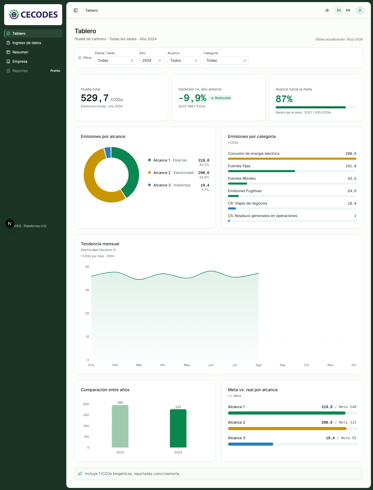

You do not need to understand this screen yet. It is only here so you can see the destination.

---

## 2. Before you start

**CECODES creates your account for you.** You do not sign up, and you do not create your own
company. The CECODES team sets up your company, your first location, and a login for each person,
and then sends you:

- an **email** (your username), and
- a **temporary password**.

Have those two things next to you before you begin. If you do not have them yet, write to CECODES
and ask; there is nothing you can do in the tool until they exist.

It also helps to gather, for the year you are reporting:

- your **fuel** records (diesel, gasoline), in the units your invoices use,
- your twelve monthly **electricity** bills (in kWh),
- any **business flights**, **waste**, or other indirect activities you want to include.

You do not need all of it before you start. You can type what you have, leave the rest blank, and
come back later. Blank simply means "not reported yet".

---

## 3. The walkthrough: from sign in to a finished report

Do these in order. Each step is one small action. After most steps there is a line that tells you
what success looks like, so you always know the click worked.

### Step 1. Open the tool and sign in

You will land on a screen titled **Iniciar sesión** (Sign in). It has two boxes and a green button.

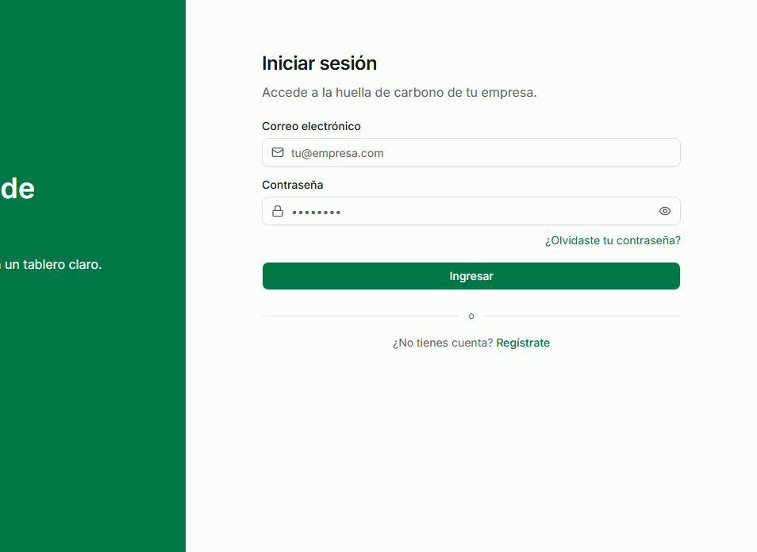

1. Click the first box, **Correo electrónico** (Email), and type the email CECODES gave you.
2. Click the second box, **Contraseña** (Password), and type your temporary password. The dots hide
   what you type; that is normal. To check it, click the small eye icon at the right end of the box.
3. Click the green **Ingresar** (Sign in) button.

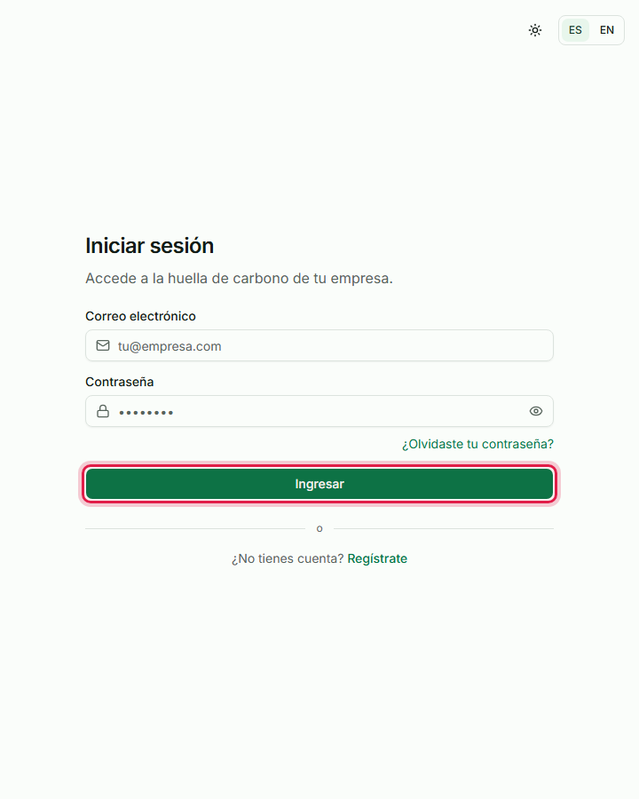

**Success looks like:** the sign-in screen disappears and your dashboard opens. That is Step 2.

> **You already have an account.** At the very bottom of the sign-in screen there is a line that
> says **¿No tienes cuenta?** (No account?) with a green **Regístrate** (Sign up) link. Ignore it.
> CECODES already made your account for you, so you never need to sign up.
>
> 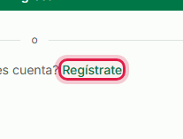

> **If it will not let you in:** if you see **Correo o contraseña incorrectos** (Wrong email or
> password) in red, check for a typo and try again. If you see **Tu cuenta fue desactivada**
> (Your account was deactivated), your login has been switched off; write to CECODES. Forgot your
> password? Click **¿Olvidaste tu contraseña?** (Forgot your password?) and a reset link is emailed
> to you.

### Step 2. Look around the dashboard

The first time you sign in, you land on your **Tablero** (Dashboard). If your company is brand new
and no data has been entered yet, it looks like this: mostly empty, with an invitation to start.

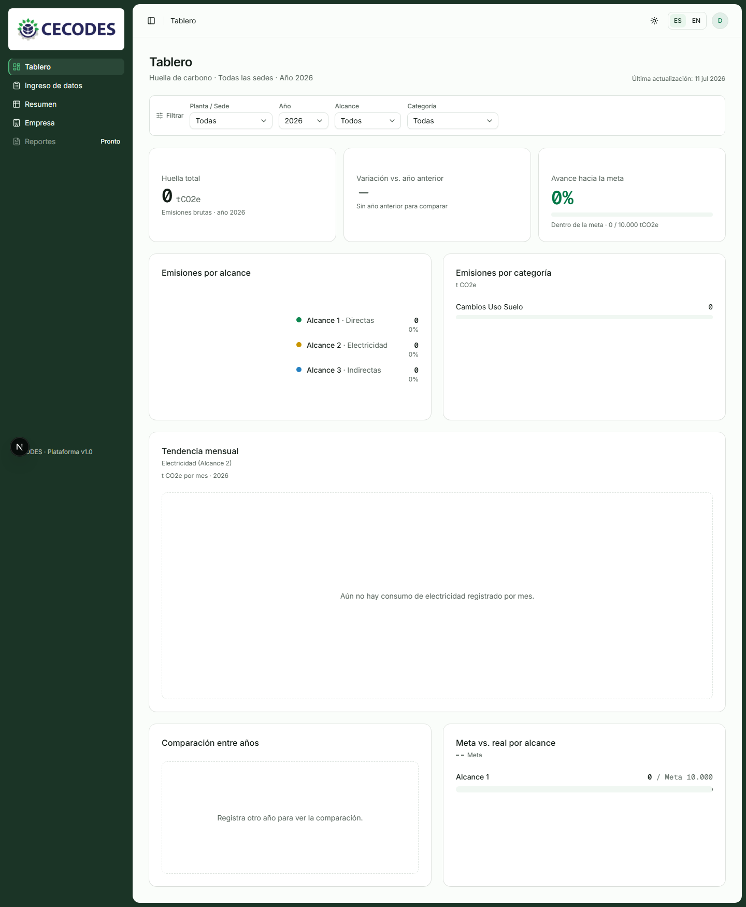

That is exactly right. An empty dashboard is not a problem; it just means there is nothing to show
yet. You are about to fill it. Do not click anything here yet; read Step 3 first.

> **If you see a screen that says your account has no company:** the words **Tu cuenta aún no tiene
> empresa** (Your account does not have a company yet) mean your login has not been linked to a
> company. You cannot fix this yourself. Write to CECODES and they will connect it.

### Step 3. Understand the menu on the left

Everything you do lives in the dark green **menu on the left side** of the screen. From top to
bottom, a company user has five items:

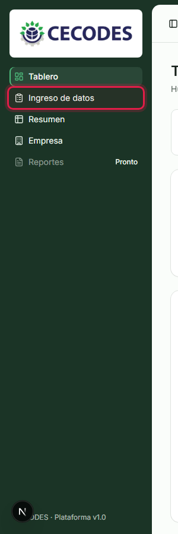

- **Tablero** (Dashboard): your results, as charts. This is where you are now.
- **Ingreso de datos** (Data entry): where you type your numbers. This is the main screen, and where
  you will spend most of your time.
- **Resumen** (Summary): all your data in one table, and the download buttons.
- **Empresa** (Company): your company details and your locations.
- **Reportes** (Reports): marked **Pronto** (Coming soon), so it does nothing yet.

### Step 4. Find the controls at the top

Along the very **top of the screen**, on the **right side**, there are three small controls:

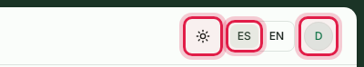

- A **sun or moon icon**, **Cambiar tema** (Change theme): switches the screen between **Claro**
  (Light), **Oscuro** (Dark), and **Sistema** (Follow your computer). Use whichever is easier on
  your eyes.
- **ES / EN**: switches the whole tool between Spanish and English. When you click it, the page
  takes a moment to reload in the new language, and a small message confirms when it is done.
- A **round button with your initial**: your account menu. Click it to find **Cerrar sesión**
  (Sign out) when you are done for the day.

### Step 5. Go to the data entry screen

In the **left menu**, click **Ingreso de datos** (Data entry).

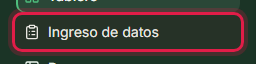

**Success looks like:** the main area changes to a screen titled **Ingreso de datos**, with a note
under it that says the changes save by themselves.

### Step 6. Choose a location and a year

Near the top of the data entry screen there is a bar with two dropdowns: **Sede** (Location) on the
left and **Año** (Year) on the right.

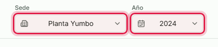

1. Click **Sede** (Location) and pick the location you are entering data for. If your company has
   only one, it is already chosen.
2. Click **Año** (Year) and pick the year you are reporting.

Everything you type below belongs to this location and this year together. Your choice is remembered
in the address of the page, so if you reload or share the link, you come back to the same place.

### Step 7. Create a year, if there is not one yet

If this location has no years yet, instead of the year dropdown you will see a message,
**Aún no hay años de reporte** (No reporting years yet), with a button.

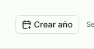

1. Click the **Crear año** (Create year) button.
2. A small window opens titled **Crear año de reporte** (Create a reporting year). Click the **Año**
   (Year) box and type the year, for example `2024`.

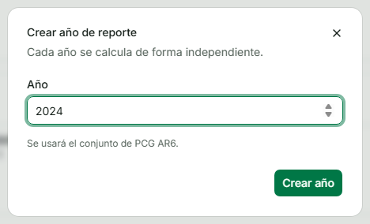

You will see a line like **Se usará el conjunto de PCG AR6** (The AR6 GWP set will be used). That is
the official set of scientific conversion values for that year. It is fixed the moment you create
the year, on purpose: if the science is updated later, your finished years do not silently change.

3. Click the **Crear año** (Create year) button inside the window to confirm.

**Success looks like:** the window closes and the new year appears in the **Año** dropdown, already
selected.

### Step 8. Pick a scope

Below the bar there are three tabs: **Alcance 1**, **Alcance 2**, and **Alcance 3** (Scope 1, 2 and
3). These are the three groups every carbon footprint is split into.

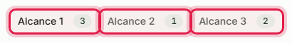

In plain terms:

- **Alcance 1** (Scope 1): what your company burns or leaks itself. Diesel in a generator, fuel in
  company trucks, refrigerant gas escaping from air conditioning.
- **Alcance 2** (Scope 2): the electricity you buy from the grid. This is the only group entered
  **month by month**.
- **Alcance 3** (Scope 3): everything indirect. Business flights, things you bought, waste.

The small number on a tab tells you how many sources you have already added there. Click
**Alcance 1** to start.

### Step 9. Say whether a category applies

Each scope is divided into categories (for example *Fuentes Fijas*, stationary sources, or *Fuentes
Móviles*, mobile sources). Each category has a small switch labelled **¿Aplica?** (Does it apply?).

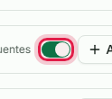

This switch is not just decoration. The greenhouse gas standard asks a company to **declare** the
categories it does not have, so turning one off is real, reportable information, not a way to hide
something. Leave a category **on** if your company has it. Turn it **off** only for things your
company genuinely does not do.

> **Once a category has sources in it, the switch locks.** If you cannot turn a category off, it is
> because it still holds sources. The tool is protecting your data: delete the sources first, and
> then the switch unlocks. This is on purpose, so a single click can never erase numbers you typed.

### Step 10. Add a source

A "source" is one specific thing you consumed, like diesel or electricity.

1. Click the **Agregar fuente** (Add source) button inside the category.

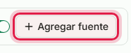

2. A search box opens, **Buscar elemento...** (Search for an element). Start typing the name of what
   you consumed, for example `diesel`.

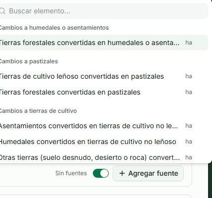

3. Click the element you want in the list. It is added, and the search closes.

A few things that are meant to reassure you here:

- You **cannot invent or misspell** an element. You can only pick one from the official list, so
  every company calculates the same way.
- The search **ignores accents**, so typing `diesel` still finds `Diésel`.
- If an element is already added, it shows a check mark and cannot be added twice. That is fine.
- The correct **unit** (like galones or kWh) comes with the element automatically. You never choose
  it.

### Step 11. Type the amount for the whole year (Scope 1 and 3)

For **Alcance 1** and **Alcance 3**, each source has a single box, **Valor anual** (Annual value):
one number for the whole year. The unit is shown inside the box, on the right, so you always know
what you are typing.

Here is our worked example. Suppose your diesel invoice for the year totals **14.957,1 galones**
(fourteen thousand nine hundred fifty-seven point one gallons). You type it into the **Valor anual**
box **without the thousands dot**, like this: `14957,1`.

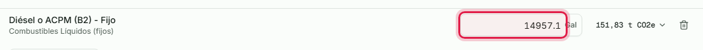

The box in the picture shows `14957.1`, which is the same number. Notice that the tool does not add a
thousands dot for you: it keeps the number the way you type it. Notice too the small unit **Gal**
(gallons) inside the box, and, just to the right of it, the tool has already worked out what that
diesel adds up to: **151,83 t CO2e**. It updates as you type.

> **This is the one number rule that matters.** Never type a thousands separator. If you type
> `14.957,1`, the tool reads the dot as a decimal point and stores **14,9571**, which is wrong, and
> nothing on screen looks wrong. Section 4 is entirely about this. It is worth two minutes.

### Step 12. Read the live result, and what is inside it

That small number next to the source (**151,83 t CO2e** in our example) is a live estimate. Click on
it to open a panel that shows exactly how it was worked out.

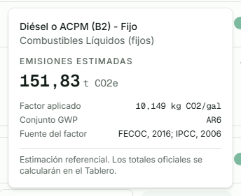

You will see:

- **Emisiones estimadas** (Estimated emissions): the result, in **t CO2e**.
- **Factor aplicado** (Factor applied): the conversion number that was used, with its unit
  (here **10,149 kg CO2/gal**).
- **Conjunto GWP** (GWP set): the scientific set of values behind it (here **AR6**).
- **Fuente del factor** (Factor source): the study the number comes from, so anyone can check it.

At the bottom it says **Estimación referencial. Los totales oficiales se calcularán en el Tablero**
(Reference estimate. The official totals are calculated on the dashboard). In other words, this
number is a helpful preview while you type. The totals you report come from the **Tablero**.

> **If a factor is missing, the tool tells you in words.** It will never show `0.0 t` for something
> it could not calculate, because a real zero and a missing factor must never look the same.

### Step 13. Enter electricity, month by month (Scope 2)

Electricity is different, because CECODES reports it monthly. Click the **Alcance 2** tab, then open
your electricity source. Instead of one box, you get **twelve boxes**, **Enero** to **Diciembre**
(January to December).

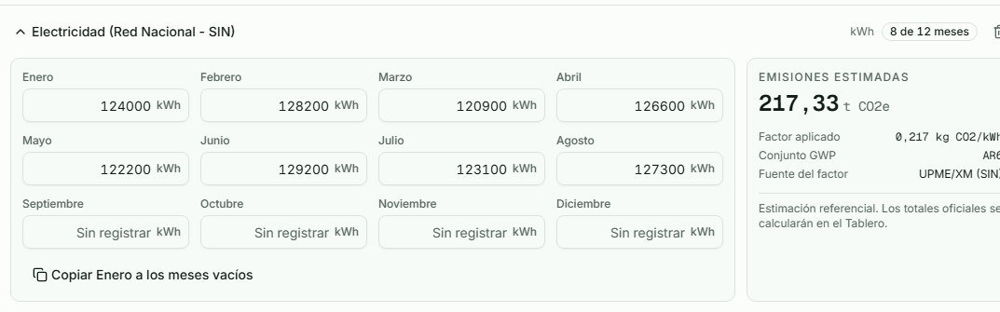

Type each month's kWh into its own box. As you go, a small badge keeps count, for example **8 de 12
meses** (8 of 12 months), so you can see how far you have come. It is fine to stop partway and come
back; the empty months just stay empty.

### Step 14. Use the January shortcut, if it helps

If your electricity is about the same every month, you do not have to type all twelve.

1. Type your January (**Enero**) value.
2. Click the **Copiar Enero a los meses vacíos** (Copy January to the empty months) button.

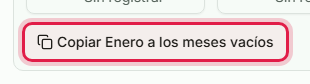

It fills **only the empty months**, and it never overwrites a month you already typed. So you can
copy January across, then correct the two or three months that were different.

> If the button does nothing, hover over it: it will say either **Registra primero el valor de
> Enero** (Enter January first) or **Todos los meses ya tienen valor** (Every month already has a
> value). Both are normal.

### Step 15. Notice that it saves by itself

There is **no Save button** anywhere on this screen, and you do not need one. Look at the **top
right** of the data entry screen, near the year. There is a small indicator that tells you the
state of your work.

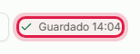

It reads:

| What it says | What it means |
|---|---|
| **Se guarda automáticamente** (Saves automatically) | Nothing pending, you are up to date |
| **Guardando...** (Saving) | Your latest change is being sent |
| **Guardado 14:32** (Saved 14:32) | Saved, at that time |
| **No se pudo guardar** (Could not save) | Something went wrong; the box returns to its last saved value and the tool tells you |

If you try to close the tab while a change is still saving, the browser warns you first. So you can
relax: your typing is safe.

### Step 16. Set a reduction target, if you have one (optional)

Above the sources, each scope has a **Meta de reducción** (Reduction target): the target you are
aiming for, in **t CO2e**. It is optional.

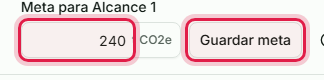

1. Type your target into the **Meta para Alcance 1** (Target for Scope 1) box.
2. Click **Guardar meta** (Save target).

Your progress toward it later appears on the **Tablero**. To remove a target, clear the box and save
again; an empty target is not a target of zero.

### Step 17. What to do when electricity shows no emissions

Electricity emissions depend on Colombia's national grid factor, which changes every year. A CECODES
administrator loads it, one value per year. If the year you are working in does not have it yet, you
will see a calm yellow notice on the **Alcance 2** tab.

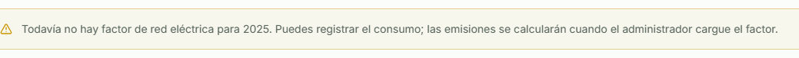

It reads **Todavía no hay factor de red eléctrica para 2025** (There is no electricity grid factor
for 2025 yet), and then tells you to keep going. So keep typing your kWh. The emissions will
calculate the moment the administrator loads the factor. Nothing you type is lost.

### Step 18. Check your work on Resumen

When you have entered what you have, it is worth looking at it all in one place before you trust it.
In the **left menu**, click **Resumen** (Summary).

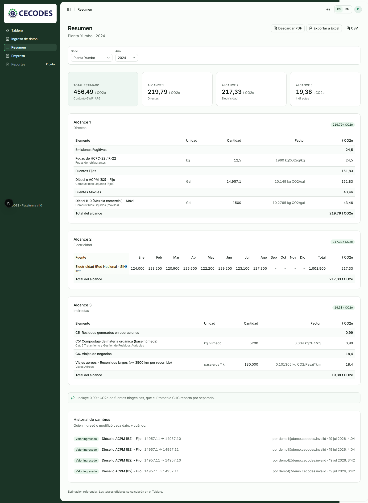

At the top you get your **Total estimado** (Estimated total) and a card for each scope.

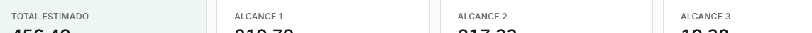

Below that is one table per scope, listing each element with its **Unidad** (Unit), **Cantidad**
(Quantity), **Factor** (Factor), and **t CO2e**. Alcance 2 shows the twelve months across the table.
Pick the **Sede** (Location) and **Año** (Year) with the two dropdowns at the top, exactly like on
the data entry screen. This table is the easiest way to spot a number that looks wrong.

### Step 19. See who entered each number

Scroll to the bottom of **Resumen**. Once data has been entered through the tool, there is a panel
called **Historial de cambios** (Change history).

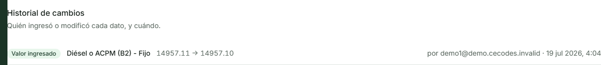

It lists who entered or changed each number, and when, for this location and year. If several people
from your company use the tool, this is how you find out who to ask about a particular figure. On a
brand-new company that has just been set up, this panel is empty until the first number is typed.

### Step 20. Download your report

At the **top right of Resumen** there are three buttons.

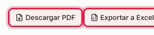

- **Descargar PDF** (Download PDF): a readable report with your totals, the breakdown by scope and
  category, and a table of the uncertainty (the plus or minus range) of each factor where the
  library has one.
- **Exportar a Excel** (Export to Excel): a workbook you can sum, pivot, and compare against your own
  spreadsheet.
- **CSV**: a plain text version.

Click one. A small message says **Generando el reporte** (Generating the report), and then the file
downloads. The buttons only appear when there is a location, a year, and some data to export.

### Step 21. Keep your company details and locations tidy

In the **left menu**, click **Empresa** (Company). This screen holds two things.

**Your company profile**, under **Información de la empresa** (Company information): name, sector,
and an optional contact email. These appear on your reports. Change what you need and click
**Guardar cambios** (Save changes).

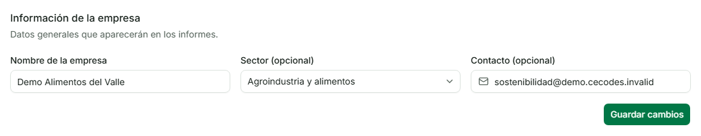

**Your locations**, under **Sedes** (Locations). Each sede is one plant at one place, measured
separately.

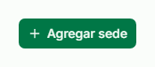

From here you can:

- Click **Agregar sede** (Add location) to add another location (a **Planta**, plant, and its
  **Ubicación**, location).
- See each location's **Años de reporte** (Reporting years).
- Click **Ingresar datos** (Enter data) to jump straight into entering that location's data.

> A location's name must be unique inside your company, and you cannot delete a location that still
> has reporting years. Both rules exist so a single click can never wipe real data.

That is the whole journey. Sign in, enter your numbers, check them on Resumen, download the report.

---

## 4. How to type numbers (please read this one)

This is the section worth reading twice, because it is the one place where a mistake is silent: the
tool does exactly what you typed and nothing looks wrong.

Under every number box the tool prints the rule: **Solo valores no negativos. Decimales con coma (,)
o punto (.). No uses separador de miles** (Only non-negative values. Decimals with a comma or a dot.
Do not use a thousands separator).

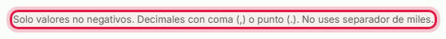

### Decimals: a comma or a dot, both work

**`3,4` and `3.4` are both accepted, and both mean three point four.** Use whichever feels natural.
The comma is completely fine.

| You type | The tool stores | |
|---|---|---|
| `3,4` | 3.4 | correct |
| `3.4` | 3.4 | correct |
| `3,44567` | 3.44567 | correct |
| `3.44567` | 3.44567 | correct |

### Never type a thousands separator

This is the one real rule, and the whole reason for this section.

| You mean | Type this | Do NOT type |
|---|---|---|
| One thousand two hundred | `1200` | `1.200` or `1,200` |
| Fourteen thousand nine hundred fifty-seven point one | `14957,1` or `14957.1` | `14.957,1` |

**Why it matters:** a lone dot is always read as a decimal point. If you type `1.200` meaning one
thousand two hundred, the tool reads **1.2**, and nothing looks wrong. That is the mistake nobody
catches later. So when you copy a number off an invoice that shows `14.957,1`, remove the thousands
dot and type `14957,1`.

### The rest of the rules

- **Up to 6 decimal places.** `3.44567` is fine. Something longer, like `3.4567891`, is refused with
  a visible message, so you will know.
- **No negative numbers.**
- **Blank is not zero.** Leave a box empty when you have no data yet: that means "not reported yet".
  Type `0` only when your company genuinely consumed nothing. The tool keeps these two apart on
  purpose, and the monthly chart shows an unreported month as a gap, not as a zero.
- **Pasting from Excel** mostly works. A Colombian-style `1.234,56` is understood as one thousand two
  hundred thirty-four point five six. The US style `1,234.56` is refused rather than guessed at.
- A half-typed value like `12,` stays on the screen so your cursor does not jump, but it is not saved
  until it is a complete number.

---

## 5. A plain-language glossary

| Word on screen | What it means |
|---|---|
| **Empresa** | Your company |
| **Sede** | One physical location: a plant, an office, a warehouse. A company can have several |
| **Año** | One reporting year, for example 2024. Each year is calculated on its own |
| **Alcance 1 / 2 / 3** | The three groups of emissions (Scope 1 / 2 / 3) |
| **Fuente** / **Elemento** | A source: one specific thing you consumed, like diesel or electricity |
| **Valor anual** | The amount for the whole year, for Scope 1 and Scope 3 |
| **Factor de emisión** | The official conversion number that turns an amount into emissions |
| **t CO2e** | Tonnes of CO2 equivalent. Every figure the tool shows is in tonnes |
| **Conjunto GWP / PCG** | The scientific set of values (like AR6) used to combine the gases |
| **Meta** | An optional reduction target you set for a scope |
| **Tablero** | The dashboard, where your official totals and charts live |
| **Resumen** | The summary table, and where you download reports |

---

## 6. Quick answers to common worries

**Can I write 3,4 or 3.4?**
Both. They mean the same thing. Use whichever your team prefers.

**How do I write one thousand two hundred?**
Type `1200`. Never `1.200`, which the tool would read as 1.2.

**Where is the Save button?**
There is not one. It saves as you type. The indicator at the top right tells you when.

**I left a box empty. Is that zero?**
No. Empty means "not reported yet". Type `0` only if your company really consumed nothing.

**Why is electricity split into twelve boxes?**
Because CECODES reports electricity month by month. Scope 1 and Scope 3 are one annual figure each.

**My electricity shows no emissions.**
The national grid factor for that year has not been loaded yet. Keep entering your kWh; it calculates
as soon as a CECODES administrator loads the factor.

**I cannot turn off a category.**
It still has sources in it. Delete them first, and then the switch unlocks.

**Can two people from my company use the tool?**
Yes. Each person gets their own login, and they all see the same company data.

**Is the number next to a source the official total?**
No, it is a reference estimate to help you as you type. The official totals are on the **Tablero**.

**Can I change the language?**
Yes, with the **ES / EN** switch at the top right, at any time.

**I signed in and it says my company was deactivated.**
The screen **Empresa desactivada** (Company deactivated) means a CECODES administrator switched your
whole company off. Your data is kept safe. Write to CECODES to switch it back on.

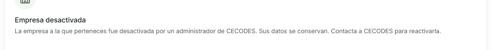

**It refused my login and mentions my account.**
The message **Tu cuenta fue desactivada** (Your account was deactivated) means your personal login
was switched off, even though your company is fine. Write to CECODES.

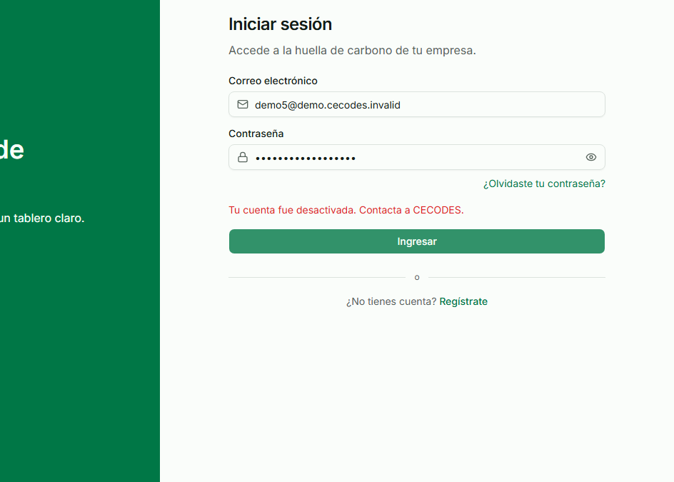

**Do I ever need Regístrate or Configura tu empresa?**
No. CECODES creates every account and every company. If you land on a screen asking you to set up a
company, it means your login is not linked yet; write to CECODES.
