# CECODES Carbon Footprint Tool: Step-by-Step Tutorial

A slow, patient, click-by-click tutorial. It assumes you have never used the tool and do not want
to break anything. Just do each step in order. Every step tells you exactly what to click, where it
is on the screen, and how to know it worked.

The tool's screens are in **Spanish (es-CO)**. This tutorial is in English and shows the Spanish
words exactly as they appear on the screen, in bold, with the English meaning next to them. So when
you read click **Ingresar** (Sign in), look for the button that says **Ingresar**.

> **¿Prefieres esta guía en español?** There is a full Spanish version: [USER_GUIDE.es.md](USER_GUIDE.es.md).

---

## 0. What this tool does, in five sentences

Your company enters how much it consumed in a year: fuel, electricity, waste, travel. The tool
multiplies each amount by an official conversion number and adds it all up. The result is your
**carbon footprint** *(huella de carbono)*, measured in **tonnes of CO2 equivalent (t CO2e)**. You
see it on a dashboard and you can download it as a report. That is the whole tool, and this
tutorial walks you through it once, from start to finish.

---

## 1. Before you start (Antes de empezar)

**You do not create your own account or company.** The CECODES team sets up your company for you and
gives you a **sign-in** *(correo)* and a **temporary password** *(contraseña temporal)*. If you do
not have those yet, contact CECODES.

Have your consumption numbers for the year nearby: litres or gallons of fuel, kWh of electricity
month by month, kilometres travelled, kilograms of waste. You can also enter them little by little
and come back later; nothing is lost.

---

## 2. Sign in (Iniciar sesión)

**2.1** Open the tool's web address. You land on the sign-in screen, titled **Iniciar sesión**.

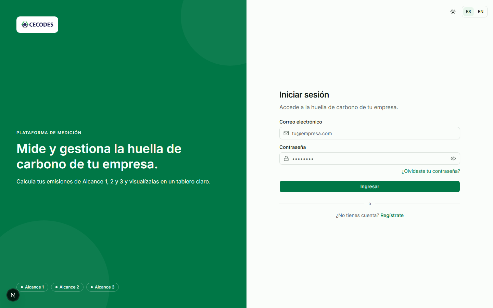

**2.2** In the **first box** (**Correo**, Email), type your email address.

**2.3** In the **second box** (**Contraseña**, Password), type your password.

**2.4** Click the green button that says **Ingresar** (Sign in).

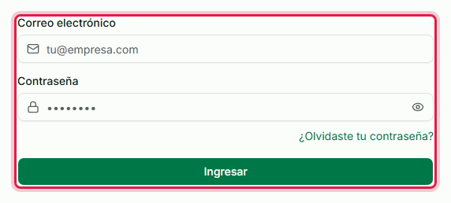

**It worked when:** the page changes and you see your **Tablero** (Dashboard). That is your home
screen.

**If something else happens:**
- If it says **Correo o contraseña incorrectos** (Wrong email or password), check for a typo and
  try again. Forgot it? Click **¿Olvidaste tu contraseña?** and a reset link is emailed to you.
- If it says **Tu cuenta fue desactivada** (Your account was deactivated) or you see **Empresa
  desactivada** (Company deactivated), your data is safe; contact CECODES to switch it back on.
- If you see a screen saying your account has no company yet, your sign-in is not linked to a
  company. Contact CECODES and they will connect it.

---

## 3. Finding your way around

The **left side** of the screen is the menu. These are the places you can go:

| Menu item | What it is for |
|---|---|
| **Tablero** | Your results, as charts. This is the dashboard. |
| **Ingreso de datos** | Where you type your consumption. This is the main screen. |
| **Resumen** | All your data in one table, plus the download buttons. |
| **Empresa** | Your company details and your sites *(sedes)*. |

The **top right** has three small controls: a **sun/moon** to switch light and dark, an **ES / EN**
switch to change the language, and a **circle with your initial** which opens your account menu
(with **Cerrar sesión**, Sign out).

---

## 4. Go to data entry, and choose a site and a year

**4.1** In the left menu, click **Ingreso de datos** (Data entry).

**4.2** At the top of the screen, choose your **Sede** (site) and your **Año** (year) from the two
drop-down boxes. Everything you type below belongs to that site and that year.

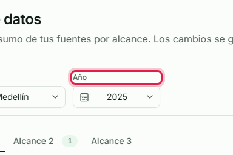

**If there is no year yet:** you will see **Aún no hay años de reporte** (No reporting years yet).
Click **Crear año** (Create year), type the year (for example `2024`), and confirm. A small note
about **PCG AR6** may appear; that is just the official science set for that year, and it is fixed
when you create the year. That is on purpose, so old years never change by themselves.

---

## 5. Choose the group: Alcance 1, 2, or 3

Emissions come in three groups, shown as three **tabs** near the top.

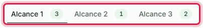

- **Alcance 1** (Scope 1): what your company **burns or leaks itself**, like diesel in a generator,
  fuel in company vehicles, or refrigerant gas that escapes.
- **Alcance 2** (Scope 2): the **electricity** you buy. This is the only group you enter **month by
  month**.
- **Alcance 3** (Scope 3): everything **indirect**, like business flights, purchased goods, and
  waste.

**4.1** Click the tab for the group you want to enter. Start with **Alcance 1**.

The small number on a tab tells you how many sources you have already added there.

---

## 6. Does this category apply? The ¿Aplica? switch

Inside each group are **categories** (for example **Fuentes Fijas**, stationary combustion). Each
category has a small switch labelled **¿Aplica?** (Does it apply?).

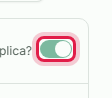

This is not decoration. The greenhouse-gas standard asks a company to **declare** the categories it
does not have. So if your company genuinely has nothing in a category, turn its switch **off**. That
is saved as real information, not just hidden.

Once a category has data in it, the switch **locks**. To turn it off you must first remove its
sources, so that recorded data can never disappear behind a switch.

---

## 7. Add a source (Agregar fuente)

A **source** *(fuente)* is one specific thing you consumed, like a particular fuel.

**7.1** Find the category you want (for example **Fuentes Fijas**) and click **Agregar fuente**
(Add source).

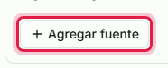

**7.2** A search box opens with the official list of elements. Type a few letters to find yours (for
example type `diesel` to find **Diésel**; accents do not matter).

**7.3** Click the one you want. It is added, and a box appears for you to type the amount.

You **cannot** invent or misspell an element; you always pick from the list, so every company
calculates the same way. An element you already added shows a check mark and cannot be added twice.

---

## 8. Type an annual value (Alcance 1 and Alcance 3)

For **Alcance 1** and **Alcance 3**, each source has **one box** for the whole year, labelled
**Valor anual** (Annual value). The unit (like `gal` or `kg`) is shown inside the box.

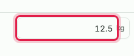

**8.1** Click the box and type your number. Read section 10 first if you are unsure how to type it.

**Worked example:** for **Diésel o ACPM (B2) - Fijo**, measured in gallons, type `14957,1`. The tool
shows it as `14.957,1` and calculates about **151,83 t CO2e**.

**8.2** Click somewhere else, or press Tab, to leave the box.

**It worked when:** a small **Guardado** (Saved) label with the time appears at the **top right**.

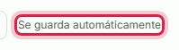

**There is no Save button.** The tool saves by itself as you type. The label at the top right tells
you the state: **Se guarda automáticamente** (saves automatically, nothing pending), **Guardando...**
(saving), **Guardado 14:32** (saved, at that time), or **No se pudo guardar** (could not save, in
which case the box goes back to its last saved value and you try again).

---

## 9. Electricity: the twelve months (Alcance 2)

Electricity is different: you enter it **month by month**.

**9.1** Click the **Alcance 2** tab.

**9.2** Add the electricity source the same way (section 7). Instead of one box, you get **twelve**,
**Enero** to **Diciembre** (January to December).

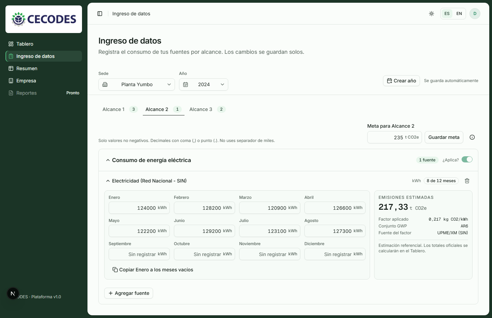

**9.3** Type each month's kWh into its box.

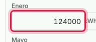

A small badge shows your progress, like **8 de 12 meses** (8 of 12 months).

**Shortcut:** if your electricity is about the same every month, type **Enero** (January) once, then
click **Copiar Enero a los meses vacíos** (Copy January to the empty months). It fills only the
**empty** months and never overwrites one you already typed.

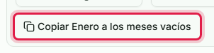

**If you see a yellow warning about the factor de red** (grid factor): that just means CECODES has
not loaded the electricity conversion number for that year yet. **Keep typing your kWh anyway.** The
emissions will calculate the moment CECODES loads it.

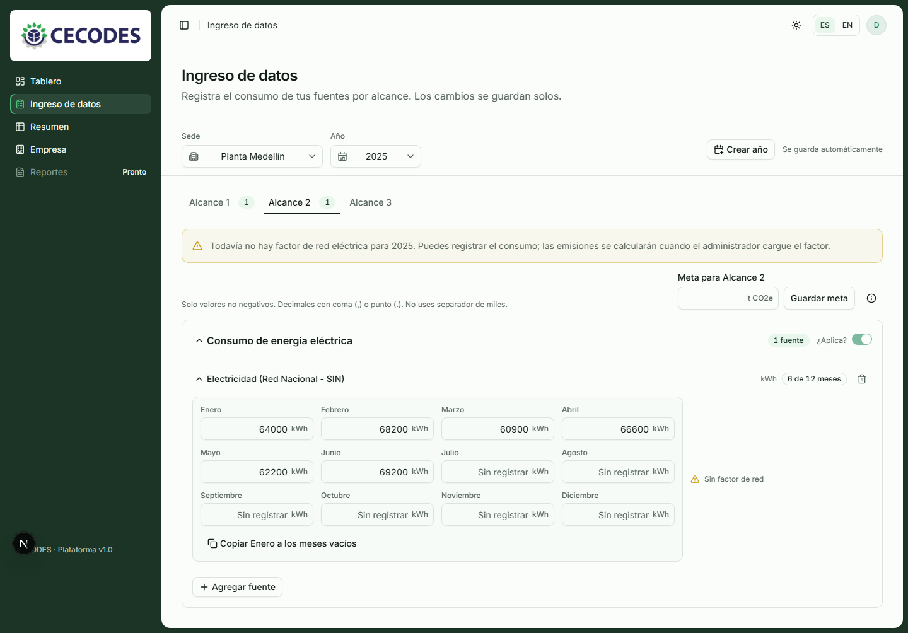

---

## 10. The most important lesson: how to type numbers

This is where mistakes happen quietly, so read it carefully.

### Comma or dot, both mean a decimal point

**`3,4` and `3.4` both mean three point four.** Use whichever is natural for you. The comma is fine.

### NEVER type a thousands separator

This is the one real rule. To write one thousand two hundred, type **`1200`**. Do **not** type
`1.200` or `1,200`.

| You mean | Type this | Do NOT type |
|---|---|---|
| One thousand two hundred | `1200` | `1.200` or `1,200` |
| Fourteen thousand nine hundred fifty-seven point one | `14957,1` or `14957.1` | `14.957,1` |
| Three point four | `3,4` or `3.4` | (nothing to avoid here) |

**Why it matters:** a lone dot is always read as a decimal point. If you type `1.200` meaning one
thousand two hundred, the tool reads **1.2**, and nothing on the screen looks wrong. That is a
mistake nobody catches later. The tool shows the rule under every box:
*"Solo valores no negativos. Decimales con coma (,) o punto (.). No uses separador de miles."*

### The other rules

- **Up to 6 decimals.** `3,44567` is fine. `3,4567891` is rejected with a visible message.
- **No negative numbers.**
- **Blank is not zero.** Leave a box empty when you have no data yet; that means *"not reported"*.
  Type `0` only when the company truly consumed nothing. The tool keeps these apart on purpose.

---

## 11. See what you added, and download it (Resumen)

**11.1** In the left menu, click **Resumen** (Summary). It shows everything you entered in one
table, which is the easiest way to check a year before you trust it.

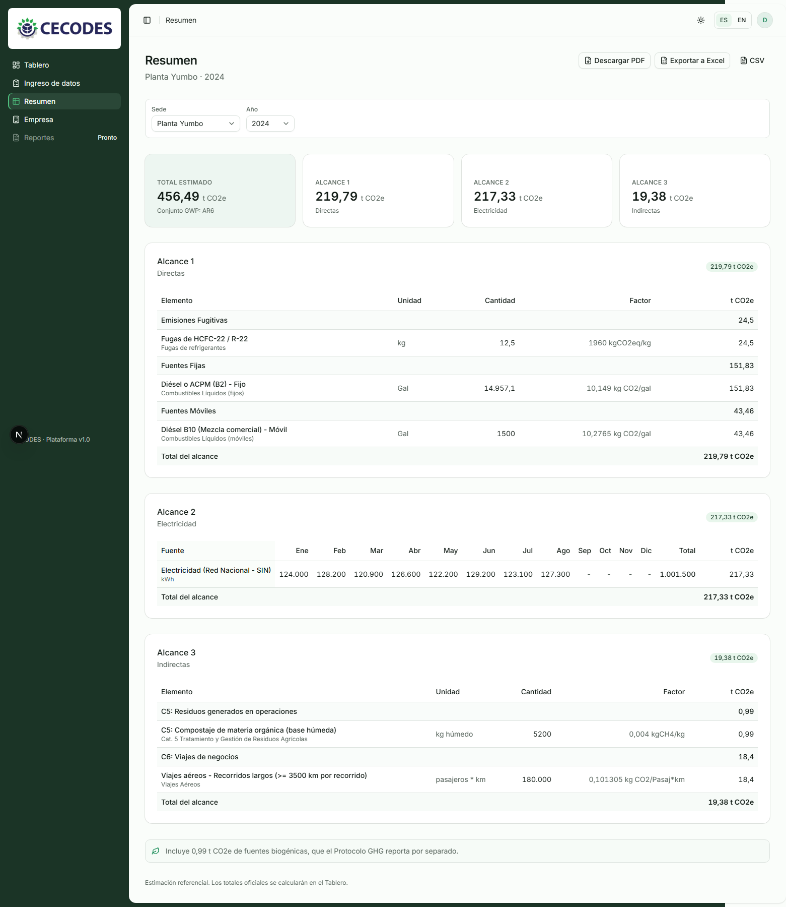

At the top are your **Total estimado** (estimated total) and a card per Alcance. Below is one table
per Alcance, with each element, its unit, the amount, the factor, and the **t CO2e**.

**11.2** To download a report, use the three buttons at the **top right**:

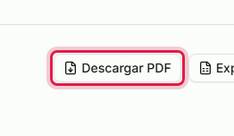

- **Descargar PDF** (Download PDF): a readable report with the totals and a table of the uncertainty
  of each factor. This is the one to send or print.
- **Exportar a Excel** (Export to Excel): a workbook you can open in Excel and total yourself.
- **CSV**: a plain-text version.

**Who changed what.** At the bottom of Resumen, a **Historial de cambios** (Change history) panel
shows who entered or changed each number, and when. If several people from your company use the
tool, this is how you find out who to ask about a figure. It appears once data has been entered
through the tool.

---

## 12. Read your results (Tablero)

**12.1** In the left menu, click **Tablero** (Dashboard). It is read-only and answers four
questions.

- **How big is our footprint?** The **Huella total** card, in t CO2e.
- **Did it go up or down?** The **Variación vs. año anterior** card. Green with a down arrow is a
  reduction; red with an up arrow is an increase.
- **Are we on track?** The **Avance hacia la meta** card, if a target *(meta)* is set.
- **Where does it come from?** The rings and bars: **Emisiones por alcance** (by scope), **Emisiones
  por categoría** (by category), and **Tendencia mensual** (electricity month by month, where an
  unreported month is a gap, not a zero).

The four boxes at the top (**Planta / Sede**, **Año**, **Alcance**, **Categoría**) let you narrow
the view.

---

## 13. Glossary (in plain words)

| Word on screen | What it means |
|---|---|
| **Empresa** | Your company. |
| **Sede** | One site: a plant, an office, a warehouse. A company can have several. |
| **Año** | One reporting year, like 2024. Each year is calculated on its own. |
| **Alcance 1 / 2 / 3** | The three groups of emissions (Scope 1 / 2 / 3). |
| **Fuente** / **Elemento** | A source: one specific thing you consumed. |
| **Factor de emisión** | The official number that turns an amount into emissions. |
| **t CO2e** | Tonnes of CO2 equivalent. Every result is in tonnes. |
| **Meta** | An optional reduction target. |
| **Valor anual** | The one yearly number for a Scope 1 or Scope 3 source. |
| **Guardado** | Saved. |

---

## 14. Preguntas frecuentes (Quick answers)

**Where is the Save button?**
There is none. It saves as you type. The **Guardado** label at the top right tells you when.

**Can I write 3,4 or 3.4?**
Both. They mean the same thing.

**How do I write one thousand two hundred?**
`1200`. Never `1.200`, which would be read as 1.2.

**I left a box empty. Is that zero?**
No. Empty means "not reported yet". Type `0` only if you truly consumed nothing.

**Why is electricity split into twelve boxes?**
CECODES reports electricity month by month. Alcance 1 and 3 are one yearly number each.

**My electricity shows no emissions.**
The grid conversion number for that year is not loaded yet. Keep entering your kWh; it calculates as
soon as CECODES loads it.

**Can two people from my company use the tool?**
Yes. Each person signs in with their own account, and they all see the same company data. The
**Historial de cambios** shows who entered each number.

**I cannot turn off a category.**
It still has sources in it. Remove them first, then the **¿Aplica?** switch unlocks.

**Can I change the language?**
Yes, the **ES / EN** switch at the top right, any time.

**Is the estimate next to a source the official number?**
No, it is a reference estimate to help you as you type. The official totals are on the **Tablero**.

**How do I get a report to send?**
On **Resumen**, click **Descargar PDF**.
